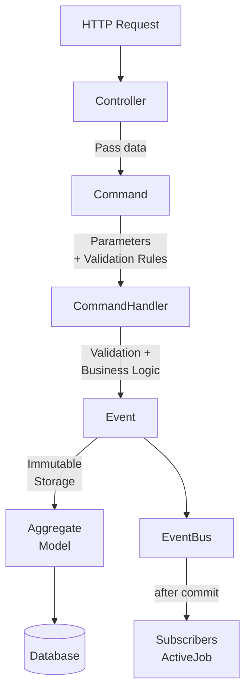

# RailsSimpleEventSourcing  

A minimalist implementation of the event sourcing pattern for Rails applications. This gem provides a simple, opinionated approach to event sourcing without the complexity of full-featured frameworks.

You don't have to go all-in. The gem can be applied to a single model or a specific part of your domain while the rest of your application continues using standard ActiveRecord. This makes it easy to adopt incrementally — start with a new feature or migrate an existing model to event sourcing when it makes sense, without rewriting your entire system.

If you need a more comprehensive solution, check out:
- https://www.sequent.io
- https://railseventstore.org

## Table of Contents
- [Features](#features)
- [Requirements](#requirements)
- [Installation](#installation)
- [Configuration](#configuration)
- [Usage](#usage)
  - [Directory Structure](#directory-structure)
  - [Commands](#commands)
  - [Command Handlers](#command-handlers)
  - [Events](#events)
  - [Model Configuration](#model-configuration)
  - [Immutability and Read-Only Protection](#immutability-and-read-only-protection)
  - [Registering Command Handlers](#registering-command-handlers)
  - [Controller Integration](#controller-integration)
  - [Update and Delete Operations](#update-and-delete-operations)
  - [Metadata Tracking](#metadata-tracking)
  - [Event Querying](#event-querying)
  - [Events Viewer](#events-viewer)
  - [Adding Event Sourcing to an Existing Model](#adding-event-sourcing-to-an-existing-model)
  - [Event Subscriptions](#event-subscriptions)
  - [Event Schema Versioning](#event-schema-versioning)
  - [Snapshots](#snapshots)
- [Testing](#testing)
- [Limitations](#limitations)
- [Troubleshooting](#troubleshooting)
  - [Command Handler Registry](#command-handler-registry)
  - [CommandHandlerNotFoundError](#commandhandlernotfounderror)
- [Contributing](#contributing)
- [License](#license)

## Features

- **Immutable Event Log** - All changes stored as immutable events with full audit trail
- **Automatic Aggregate Reconstruction** - Rebuild model state by replaying events
- **Built-in Metadata Tracking** - Captures request context (IP, user agent, params, etc.)
- **Read-only Model Protection** - Prevents accidental direct model modifications
- **Command Handler Registry** - Explicit command-to-handler mapping with fallback to convention
- **Simple Command Pattern** - Clear command → handler → event flow
- **PostgreSQL JSONB Storage** - Efficient JSON storage for event payloads and metadata
- **Built-in Events Viewer** - Web UI for browsing, searching, and inspecting events
- **Event Subscriptions** - React to events after they are committed (send emails, send webhooks, etc.)
- **Event Schema Versioning** - Built-in upcasting to evolve event schemas without modifying stored data
- **Snapshot Support** - Optional snapshots to speed up aggregate reconstruction for long event streams
- **Minimal Configuration** - Convention over configuration approach

## Requirements

- **Ruby**: 3.2 or higher
- **Rails**: 7.2.0 or higher
- **Database**: PostgreSQL 9.4+ (requires JSONB support)

## Installation

Add this line to your application's Gemfile:

```ruby
gem "rails_simple_event_sourcing"
```

And then execute:
```bash
$ bundle
```

Or install it yourself as:
```bash
$ gem install rails_simple_event_sourcing
```

Copy migration to your app:
```bash
rails rails_simple_event_sourcing:install:migrations
```

Run the migration to create the events table:
```bash
rake db:migrate
```

This creates the `rails_simple_event_sourcing_events` table that stores your event log.

## Configuration

You can configure the behavior of the gem using the configuration block:

```ruby
# config/initializers/rails_simple_event_sourcing.rb
RailsSimpleEventSourcing.configure do |config|
  # When true, falls back to convention-based handler resolution
  # When false, requires explicit registration of all handlers
  config.use_naming_convention_fallback = true

  # Number of events displayed per page in the Events Viewer (defaults to 25)
  config.events_per_page = 50

  # Automatically create a snapshot every N events per aggregate (defaults to nil = disabled)
  # With snapshot_interval = 50, a snapshot is written after every 50th event.
  # EventPlayer will load the nearest snapshot and replay only the delta,
  # instead of replaying the full event history from the beginning.
  config.snapshot_interval = 50
end
```

## Usage

### Architecture Overview

The event sourcing flow follows this pattern:



**Flow breakdown:**
1. **Controller** - Receives request, creates command with params
2. **Command** - Defines parameters and validation rules (ActiveModel)
3. **CommandHandler** - Validates command, executes business logic, creates event
4. **Event** - Immutable record of what happened
5. **Aggregate** - Model updated via event
6. **EventBus** - After the transaction commits, enqueues subscriber jobs
7. **Subscribers** - ActiveJob classes that react to events asynchronously (send emails, sync external systems, etc.). See [Event Subscriptions](#event-subscriptions) for setup details

### Directory Structure

Let's start with the recommended directory structure:

```
app/
├─ domain/
│  ├─ customer/
│  │  ├─ command_handlers/
│  │  │  ├─ create.rb
│  │  ├─ commands/
│  │  │  ├─ create.rb
│  │  ├─ events/
│  │  │  ├─ customer_created.rb
│  │  ├─ subscribers/
│  │  │  ├─ send_welcome_email.rb
```

**Note:** The top directory name (`domain/`) can be different - Rails doesn't enforce this namespace. Subscribers are ActiveJob classes (see [Event Subscriptions](#event-subscriptions)), so you can also place them in `app/jobs/` or any other autoloaded directory if that better fits your project structure.

### Commands

Commands represent **intentions** to perform actions in your system. They are responsible for:
- Encapsulating action parameters
- Validating input data (using ActiveModel validations)
- Being immutable value objects

Think of commands as "requests to do something" - they describe what you want to happen, not how it happens.

**Example - Create Command:**

```ruby
class Customer
  module Commands
    class Create < RailsSimpleEventSourcing::Commands::Base
      attr_accessor :first_name, :last_name, :email

      validates :first_name, presence: true
      validates :last_name, presence: true
      validates :email, presence: true
    end
  end
end
```

### Command Handlers

Command handlers contain the **business logic** for executing commands. They:
- Automatically validate the command before execution
- Perform business logic and API calls
- Create events when successful
- Handle errors gracefully
- Return a `RailsSimpleEventSourcing::Result` object

**Handler Discovery:**
Handlers can be discovered in two ways:
1. **Explicit Registration** (recommended) - Using the `CommandHandlerRegistry` to register handlers
2. **Convention-based** - Using naming convention mapping (can be disabled via configuration)

**Result Object:**
The `Result` class has three fields:
- `success?` - Boolean indicating if the operation succeeded
- `failure?` - Boolean indicating if the operation failed (inverse of `success?`)
- `data` - Data to return (usually the aggregate/model instance)
- `errors` - Array or hash of error messages when `success?` is false

Use the factory methods to build results:

```ruby
# Successful result
RailsSimpleEventSourcing::Result.success(data: customer)

# Failed result
RailsSimpleEventSourcing::Result.failure(errors: { email: ["already taken"] })
```

It supports a chainable API for use in controllers:
- `on_success { |data| }` - Executes the block (yielding `data`) if the result is successful
- `on_failure { |errors| }` - Executes the block (yielding `errors`) if the result failed

Both methods return `self`, so they can be chained. The predicates `success?` and `failure?` remain available for use in conditionals and tests.

```ruby
result = RailsSimpleEventSourcing::Result.success(data: customer)

# Chainable (preferred in controllers)
result
  .on_success { |data| render json: data }
  .on_failure { |errors| render json: { errors: }, status: :unprocessable_entity }

# Predicate (preferred in tests)
result.success?  # => true
result.failure?  # => false
result.data      # => #<Customer ...>
result.errors    # => nil
```

**Helper Methods in Handlers:**
Inside a command handler, `success` and `failure` are delegated to `RailsSimpleEventSourcing::Result`:
- `success(data:)` - delegates to `RailsSimpleEventSourcing::Result.success`
- `failure(errors:)` - delegates to `RailsSimpleEventSourcing::Result.failure`

**Example - Basic Handler:**

```ruby
class Customer
  module CommandHandlers
    class Create < RailsSimpleEventSourcing::CommandHandlers::Base
      def call
        event = Customer::Events::CustomerCreated.create(
          first_name: command.first_name,
          last_name: command.last_name,
          email: command.email,
          created_at: Time.zone.now,
          updated_at: Time.zone.now
        )

        success(data: event.aggregate)
      end
    end
  end
end
```

**Example - Handler with Error Handling:**

```ruby
class Customer
  module CommandHandlers
    class Create < RailsSimpleEventSourcing::CommandHandlers::Base
      def call
        event = Customer::Events::CustomerCreated.create(
          first_name: command.first_name,
          last_name: command.last_name,
          email: command.email,
          created_at: Time.zone.now,
          updated_at: Time.zone.now
        )

        success(data: event.aggregate)
      rescue ActiveRecord::RecordNotUnique
        failure(errors: ["Email has already been taken"])
      rescue StandardError => e
        failure(errors: ["An error occurred: #{e.message}"])
      end
    end
  end
end
```

### Events

Events represent **facts** - things that have already happened in your system. They:
- Store immutable data about state changes
- Use past tense naming (e.g., `CustomerCreated`, not `CreateCustomer`)
- Define which aggregate (model) they apply to
- Are stored permanently in the event log

**Key Concepts:**
- `aggregate_class` - The model this event applies to (optional - some events may not modify models)
- `event_attributes` - Fields stored in the event payload
- `apply(aggregate)` - **Optional** method that applies the event to an aggregate instance
- `aggregate_id` - Links the event to a specific aggregate instance

**Example - Basic Event (Automatic Application):**

```ruby
class Customer
  module Events
    class CustomerCreated < RailsSimpleEventSourcing::Event
      aggregate_class Customer
      event_attributes :first_name, :last_name, :email, :created_at, :updated_at
    end
  end
end
```

**Automatic Attribute Application:**

By default, all attributes declared in `event_attributes` will be **automatically applied** to the aggregate. You don't need to implement the `apply` method unless you have custom logic requirements.

The default implementation sets each event attribute on the aggregate:
```ruby
# This happens automatically
aggregate.first_name = first_name
aggregate.last_name = last_name
aggregate.email = email
# ... and so on for all event_attributes
```

**Example - Custom Apply Method (When Needed):**

You may still need to implement a custom `apply` method in certain cases:
- Setting computed or derived values
- Complex business logic during application
- Handling nested objects or special data transformations
- Setting the aggregate ID explicitly (though this is usually handled automatically)

```ruby
class Customer
  module Events
    class CustomerCreated < RailsSimpleEventSourcing::Event
      aggregate_class Customer
      event_attributes :first_name, :last_name, :email, :created_at, :updated_at

      def apply(aggregate)
        # Custom logic example
        aggregate.id = aggregate_id
        aggregate.full_name = "#{first_name} #{last_name}"  # Computed value
        aggregate.email_normalized = email.downcase.strip   # Transformation

        # You can still call super to apply remaining attributes automatically
        super
      end
    end
  end
end
```

**Understanding the Event Structure:**
- `aggregate_class Customer` - Specifies which model this event modifies
- `event_attributes` - Defines what data gets stored in the event's JSON payload and what will be automatically applied
- `current_version` - Optional; declares the current schema version for this event (defaults to 1). See [Event Schema Versioning](#event-schema-versioning)
- `apply(aggregate)` - Optional method; only implement if you need custom logic beyond automatic attribute assignment
- `aggregate_id` - Auto-generated for creates, must be provided for updates/deletes

**Note on aggregate_class:**
- Optional - you can have events without an aggregate (e.g., `UserLoginFailed` for logging only)
- The corresponding model should include `RailsSimpleEventSourcing::Events` for read-only protection

**Example - Event without an aggregate:**

When you want to record something that happened without modifying any model (audit logs, failed attempts, notifications, etc.), simply omit `aggregate_class`:

```ruby
class Customer
  module Events
    class CustomerEmailTaken < RailsSimpleEventSourcing::Event
      event_attributes :first_name, :last_name, :email
    end
  end
end
```

These events are stored in the event log like any other event, but they don't create or update an aggregate. You can create them directly:

```ruby
Customer::Events::CustomerEmailTaken.create!(
  first_name: 'John',
  last_name: 'Doe',
  email: 'john@example.com'
)
```

Or from within a command handler as part of your business logic:

```ruby
class Customer
  module CommandHandlers
    class Create < RailsSimpleEventSourcing::CommandHandlers::Base
      def call
        if Customer.exists?(email: command.email)
          Customer::Events::CustomerEmailTaken.create!(
            first_name: command.first_name,
            last_name: command.last_name,
            email: command.email
          )
          return failure(errors: { email: ['already taken'] })
        end

        # ... create the customer event
      end
    end
  end
end
```

This is useful for recording domain-significant occurrences that don't map to a state change on a model.

### Model Configuration

Models that use event sourcing should include the `RailsSimpleEventSourcing::Events` module:

```ruby
class Customer < ApplicationRecord
  include RailsSimpleEventSourcing::Events
end
```

**This provides:**
- `.events` association - Access all events for this aggregate
- Read-only protection - Prevents accidental direct modifications
- Event replay capability - Reconstruct state from events

### Immutability and Read-Only Protection

**Important Principles:**
- **Events are immutable** - Once created, events should never be modified
- **Models are read-only** - Aggregates should only be modified through events
- Both have built-in protection against accidental changes

### Registering Command Handlers

The recommended approach is to register command handlers explicitly using the registry. This makes the command-to-handler mapping explicit and avoids relying on naming conventions.

```ruby
# config/initializers/rails_simple_event_sourcing.rb

RailsSimpleEventSourcing.configure do |config|
  config.use_naming_convention_fallback = false
end

Rails.application.config.after_initialize do
  # Register all command handlers
  RailsSimpleEventSourcing::CommandHandlerRegistry.register(
    Customer::Commands::Create,
    Customer::CommandHandlers::Create
  )

  RailsSimpleEventSourcing::CommandHandlerRegistry.register(
    Customer::Commands::Update,
    Customer::CommandHandlers::Update
  )

  RailsSimpleEventSourcing::CommandHandlerRegistry.register(
    Customer::Commands::Delete,
    Customer::CommandHandlers::Delete
  )
end
```

If you prefer the convention-based approach, you don't need to take any action, as the use_naming_convention_fallback is set to true by default.

### Controller Integration

Here's how to wire everything together in a controller:

```ruby
class CustomersController < ApplicationController
  def create
    cmd = Customer::Commands::Create.new(
      first_name: params[:first_name],
      last_name: params[:last_name],
      email: params[:email]
    )

    RailsSimpleEventSourcing.dispatch(cmd)
      .on_success { |data| render json: data }
      .on_failure { |errors| render json: { errors: }, status: :unprocessable_entity }
  end
end
```

### Update and Delete Operations

**Update Example:**

Command — same structure as create, but inherits `aggregate_id` from the base class:

```ruby
class Customer
  module Commands
    class Update < RailsSimpleEventSourcing::Commands::Base
      attr_accessor :first_name, :last_name, :email

      validates :first_name, presence: true
      validates :last_name, presence: true
    end
  end
end
```

Event:

```ruby
class Customer
  module Events
    class CustomerUpdated < RailsSimpleEventSourcing::Event
      aggregate_class Customer
      event_attributes :first_name, :last_name, :email, :updated_at
    end
  end
end
```

Handler — pass `aggregate_id` to the event so it knows which aggregate to replay and update:

```ruby
class Customer
  module CommandHandlers
    class Update < RailsSimpleEventSourcing::CommandHandlers::Base
      def call
        event = Customer::Events::CustomerUpdated.create!(
          aggregate_id: command.aggregate_id,
          first_name: command.first_name,
          last_name: command.last_name,
          email: command.email,
          updated_at: Time.zone.now
        )

        success(data: event.aggregate)
      end
    end
  end
end
```

Controller:

```ruby
class CustomersController < ApplicationController
  def update
    cmd = Customer::Commands::Update.new(
      aggregate_id: params[:id],
      first_name: params[:first_name],
      last_name: params[:last_name],
      email: params[:email]
    )

    RailsSimpleEventSourcing.dispatch(cmd)
      .on_success { |data| render json: data }
      .on_failure { |errors| render json: { errors: }, status: :unprocessable_entity }
  end
end
```

**Delete Example:**

Command — only `aggregate_id` is needed (inherited from base class, no extra attributes):

```ruby
class Customer
  module Commands
    class Delete < RailsSimpleEventSourcing::Commands::Base
    end
  end
end
```

Event — uses a soft delete pattern; sets `deleted_at` instead of removing the record:

```ruby
class Customer
  module Events
    class CustomerDeleted < RailsSimpleEventSourcing::Event
      aggregate_class Customer
      event_attributes :deleted_at
    end
  end
end
```

Handler:

```ruby
class Customer
  module CommandHandlers
    class Delete < RailsSimpleEventSourcing::CommandHandlers::Base
      def call
        Customer::Events::CustomerDeleted.create!(
          aggregate_id: command.aggregate_id,
          deleted_at: Time.zone.now
        )

        success
      end
    end
  end
end
```

Controller:

```ruby
class CustomersController < ApplicationController
  def destroy
    cmd = Customer::Commands::Delete.new(aggregate_id: params[:id])

    RailsSimpleEventSourcing.dispatch(cmd)
      .on_success { head :no_content }
      .on_failure { |errors| render json: { errors: }, status: :unprocessable_entity }
  end
end
```

**Important:** For update and delete operations, you must pass `aggregate_id` to identify which record to modify. The event handler receives this via `command.aggregate_id` and uses it to find and replay the correct aggregate before applying the new event.

### Testing the API

Create a customer using curl:

```sh
curl -X POST http://localhost:3000/customers \
  -H 'Content-Type: application/json' \
  -d '{ "first_name": "John", "last_name": "Doe", "email": "john@example.com" }' | jq
```

Response:

```json
{
  "id": 1,
  "first_name": "John",
  "last_name": "Doe",
  "created_at": "2024-08-03T16:52:30.829Z",
  "updated_at": "2024-08-03T16:52:30.848Z"
}
```

### Event Querying

Open the Rails console (`rails c`) to explore the event log:

```ruby
# Get the customer
customer = Customer.last
# => #<Customer id: 1, first_name: "John", last_name: "Doe", ...>

# Access all events for this customer
customer.events
# => [#<Customer::Events::CustomerCreated...>]

# Get specific event details
event = customer.events.first
event.payload
# => {"first_name"=>"John", "last_name"=>"Doe", "email"=>"john@example.com", ...}

event.metadata
# => {"request_id"=>"2a40d4f9-509b-4b49-a39f-d978679fa5ef",
#     "request_ip"=>"::1",
#     "request_user_agent"=>"curl/8.6.0", ...}

# Query events by type
RailsSimpleEventSourcing::Event.where(type: "Customer::Events::CustomerCreated")

# Get events in a date range
customer.events.where(created_at: 1.week.ago..Time.now)

# Get all events for a specific aggregate
RailsSimpleEventSourcing::Event.where(eventable_type: "Customer", eventable_id: 1)
```

**Reconstructing Aggregate State:**

You can reconstruct the aggregate state as it was at any point in time by calling `aggregate_state` on an event. This replays all events for that aggregate up to and including the given event's version, returning the resulting attributes. This is useful for debugging, auditing, or understanding how an aggregate evolved over time.

```ruby
event = customer.events.last
event.aggregate_state
# => {"id"=>1, "first_name"=>"John", "last_name"=>"Doe", "email"=>"john@example.com", ...}

# Compare state at different points in time
first_event = customer.events.first
first_event.aggregate_state
# => {"id"=>1, "first_name"=>"John", "last_name"=>"Doe", ...}

latest_event = customer.events.last
latest_event.aggregate_state
# => {"id"=>1, "first_name"=>"Jane", "last_name"=>"Smith", ...}
```

**Event Structure:**
- `payload` - Contains the event attributes you defined (as JSON)
- `metadata` - Contains request context (request ID, IP, user agent, params)
- `type` - The event class name (Rails STI column)
- `aggregate_id` - Links to the aggregate instance
- `eventable` - Polymorphic relation to the aggregate

### Metadata Tracking

To automatically capture request metadata (IP address, user agent, request ID, etc.), include the concern in your ApplicationController:

**Setup:**

```ruby
class ApplicationController < ActionController::Base
  include RailsSimpleEventSourcing::SetCurrentRequestDetails
end
```

**Default Metadata:**
By default, the following is captured:
- `request_id` - Unique request identifier
- `request_user_agent` - Client user agent
- `request_referer` - HTTP referer
- `request_ip` - Client IP address
- `request_params` - Request parameters (filtered using Rails parameter filter)

**Adding Custom Metadata:**
Override `custom_event_metadata` to add your own fields — they are merged into the defaults:

```ruby
class ApplicationController < ActionController::Base
  include RailsSimpleEventSourcing::SetCurrentRequestDetails

  def custom_event_metadata
    {
      current_user_id: current_user&.id,
      tenant_id: current_tenant&.id
    }
  end
end
```

The method must return a hash. Any keys it returns are merged on top of the default metadata (custom keys take precedence on collision).

**Overriding Default Metadata Entirely:**
If you need full control over what is captured, override `default_event_metadata` instead:

```ruby
class ApplicationController < ActionController::Base
  include RailsSimpleEventSourcing::SetCurrentRequestDetails

  def default_event_metadata
    {
      request_id: request.uuid,
      request_ip: request.ip
      # only keep what you need
    }
  end
end
```

**Metadata Outside HTTP Requests:**

When events are created outside HTTP requests (background jobs, rake tasks, console), metadata will be empty unless you set it manually. `CurrentRequest` is backed by `ActiveSupport::CurrentAttributes`, which resets automatically between requests and jobs, so you must set it at the start of each execution:

```ruby
class CustomerImportJob < ApplicationJob
  def perform(row)
    RailsSimpleEventSourcing::CurrentRequest.metadata = {
      job: self.class.name,
      job_id: job_id
    }

    RailsSimpleEventSourcing.dispatch(
      Customer::Commands::Create.new(
        first_name: row[:first_name],
        last_name: row[:last_name],
        email: row[:email]
      )
    )
  end
end
```

Any events dispatched during that job execution will carry the metadata you set. You do not need to clear it afterwards — `CurrentAttributes` resets automatically when the job finishes.

### Events Viewer

The gem ships with a built-in web UI for browsing and inspecting your event log. It is mounted as a Rails engine.

**Setup:**

Mount the engine in your `config/routes.rb`:

```ruby
Rails.application.routes.draw do
  mount RailsSimpleEventSourcing::Engine, at: "/events"
end
```

Then navigate to `/events` in your browser to access the viewer.

**Password Protection:**

In production you will likely want to restrict access to the events viewer.

*Using Rack::Auth::Basic middleware:*

```ruby
Rails.application.routes.draw do
  mount Rack::Auth::Basic.new(
    RailsSimpleEventSourcing::Engine,
    "Events"
  ) { |username, password|
    ActiveSupport::SecurityUtils.secure_compare(username, "admin") &
    ActiveSupport::SecurityUtils.secure_compare(password, Rails.application.credentials.event_sourcing_password || "secret")
  }, at: "/events"
end
```

*Using Devise authentication:*

```ruby
Rails.application.routes.draw do
  authenticate :user, ->(user) { user.admin? } do
    mount RailsSimpleEventSourcing::Engine, at: "/events"
  end
end
```

**Features:**

- **Event list** - Paginated table of all events sorted by newest first, showing event type, aggregate, aggregate ID, version, and timestamp
- **Event detail** - Click any event to view its full payload, metadata, and the reconstructed aggregate state at that version
- **Version navigation** - Navigate between previous/next versions of the same aggregate from the detail page
- **Filtering** - Filter events by event type or aggregate type using dropdown selectors
- **Search** - Search by aggregate ID, or use `key:value` syntax to search within payload and metadata (e.g., `email:john@example.com`)

### Soft Deletes

**Recommendation:** Use soft deletes instead of hard deletes to preserve event history.

**Why?**
- Events are linked to aggregates via foreign keys
- Hard deleting a record can orphan its events
- Event log becomes incomplete
- Cannot reconstruct historical state

**How to implement:**

```ruby
# Migration
class AddDeletedAtToCustomers < ActiveRecord::Migration[7.0]
  def change
    add_column :customers, :deleted_at, :datetime
    add_index :customers, :deleted_at
  end
end

# Model
class Customer < ApplicationRecord
  include RailsSimpleEventSourcing::Events

  scope :active, -> { where(deleted_at: nil) }
  scope :deleted, -> { where.not(deleted_at: nil) }
end

# Event - deleted_at is applied to the aggregate automatically via event_attributes
class Customer::Events::CustomerDeleted < RailsSimpleEventSourcing::Event
  aggregate_class Customer
  event_attributes :deleted_at
end

# Handler
class Customer::CommandHandlers::Delete < RailsSimpleEventSourcing::CommandHandlers::Base
  def call
    Customer::Events::CustomerDeleted.create!(
      aggregate_id: command.aggregate_id,
      deleted_at: Time.zone.now
    )

    success
  end
end
```

### Adding Event Sourcing to an Existing Model

You can introduce event sourcing to a model that already has data. The key step is importing existing records as initial events so that every aggregate has a complete event history going forward.

**Step 1 — Set up the event and command classes as usual:**

```ruby
class Customer
  module Events
    class CustomerCreated < RailsSimpleEventSourcing::Event
      aggregate_class Customer
      event_attributes :first_name, :last_name, :email, :created_at, :updated_at
    end
  end
end
```

**Step 2 — Include the module in your model:**

```ruby
class Customer < ApplicationRecord
  include RailsSimpleEventSourcing::Events
end
```

**Step 3 — Create a migration task to import existing records as events:**

```ruby
# lib/tasks/import_customer_events.rake
namespace :events do
  desc "Import existing customers as CustomerCreated events"
  task import_customers: :environment do
    Customer.find_each do |customer|
      next if customer.events.exists?

      Customer::Events::CustomerCreated.create!(
        aggregate_id: customer.id,
        first_name: customer.first_name,
        last_name: customer.last_name,
        email: customer.email,
        created_at: customer.created_at,
        updated_at: customer.updated_at
      )
    end
  end
end
```

Run with:
```bash
rake events:import_customers
```

After the import, every existing record has a `CustomerCreated` event as its baseline. From that point on, all changes go through the command/event flow while the rest of your application remains unchanged.

### Event Subscriptions

The `EventBus` lets you react to events after they are persisted and committed to the database. Subscribers are **ActiveJob classes** that are enqueued **after the transaction commits**, so they never execute against data that could later be rolled back and they don't block the HTTP response.

**Registering subscribers:**

```ruby
# config/initializers/rails_simple_event_sourcing.rb
Rails.application.config.after_initialize do
  RailsSimpleEventSourcing::EventBus.subscribe(
    Customer::Events::CustomerCreated,
    Customer::Subscribers::SendWelcomeEmail
  )

  RailsSimpleEventSourcing::EventBus.subscribe(
    Customer::Events::CustomerCreated,
    Customer::Subscribers::CreateStripeCustomer
  )

  RailsSimpleEventSourcing::EventBus.subscribe(
    Customer::Events::CustomerDeleted,
    Customer::Subscribers::CancelStripeSubscription
  )
end
```

**Writing a subscriber:**

Subscribers must be ActiveJob classes. Each subscriber is enqueued as its own job, giving you per-subscriber retry logic, queue configuration, and error isolation out of the box.

```ruby
class Customer
  module Subscribers
    class SendWelcomeEmail < ApplicationJob
      queue_as :default

      def perform(event)
        WelcomeMailer.with(email: event.email).deliver_later
      end
    end
  end
end
```

Since each subscriber is a standalone job, you get native ActiveJob benefits:
- **Per-subscriber queues** — route critical subscribers to high-priority queues
- **Per-subscriber retries** — configure `retry_on` per subscriber
- **Error isolation** — a failing subscriber doesn't affect others
- **Visibility** — each subscriber appears as its own job in your queue dashboard

**Subscribing to all events:**

Subscribe to `RailsSimpleEventSourcing::Event` to receive every event regardless of type — useful for audit loggers or metrics:

```ruby
RailsSimpleEventSourcing::EventBus.subscribe(
  RailsSimpleEventSourcing::Event,
  Customer::Subscribers::AuditLogger
)
```

If you subscribe the same job to both a specific event class and `RailsSimpleEventSourcing::Event`, it will be enqueued twice — once for each subscription. This is intentional and consistent with standard pub/sub behaviour.

**Delivery guarantees:**

Subscribers are enqueued via `perform_later` in an `after_commit` callback. This means delivery is **at-most-once** by default — if the queue backend (Redis, SQS, etc.) is temporarily unavailable when `perform_later` is called, the job is lost. The EventBus logs these failures individually and continues enqueuing remaining subscribers, so a single failure does not block other subscribers from being dispatched.

For stronger guarantees, consider using a database-backed queue adapter such as [solid_queue](https://github.com/rails/solid_queue) or [good_job](https://github.com/bensheldon/good_job). Since these adapters write job records to PostgreSQL, the enqueue is durable as soon as the transaction commits — eliminating the window where a network blip can lose a job.

**Error handling:**

Subscribers are dispatched as ActiveJob jobs. Use standard ActiveJob error handling to configure retries and failure behavior:

```ruby
class SendWelcomeEmailJob < ApplicationJob
  retry_on Net::OpenError, wait: :polynomially_longer, attempts: 5
  discard_on ActiveJob::DeserializationError

  def perform(event)
    # ...
  end
end
```

**Testing with EventBus:**

Use `ActiveJob::TestHelper` to assert that subscriber jobs are enqueued. Call `RailsSimpleEventSourcing::EventBus.reset!` in your test `setup` to clear all subscriptions between tests:

```ruby
class MyTest < ActiveSupport::TestCase
  include ActiveJob::TestHelper

  setup do
    RailsSimpleEventSourcing::EventBus.reset!
  end

  test "enqueues welcome email job on customer created" do
    RailsSimpleEventSourcing::EventBus.subscribe(
      Customer::Events::CustomerCreated,
      Customer::Subscribers::SendWelcomeEmail
    )

    assert_enqueued_jobs 1 do
      Customer::Events::CustomerCreated.create!(
        first_name: "John", last_name: "Doe", email: "john@example.com",
        created_at: Time.zone.now, updated_at: Time.zone.now
      )
    end
  end
end
```

### Event Schema Versioning

Over time, event schemas may need to change — fields get renamed, split, or added. Since events are immutable and stored forever, the gem provides built-in **upcasting** support to transparently transform old event payloads to the current schema when read.

**How it works:**

Each event class can declare a `current_version` and register `upcaster` blocks that transform payloads from one version to the next. When an event is loaded from the database, the `payload` method automatically runs the necessary upcasters to bring old data up to the current schema. The stored data is never modified — upcasting happens on read.

**Example — splitting a `name` field into `first_name` and `last_name`:**

```ruby
class Customer
  module Events
    class CustomerCreated < RailsSimpleEventSourcing::Event
      aggregate_class Customer
      current_version 2
      event_attributes :first_name, :last_name, :email, :created_at, :updated_at

      # v1 had a single "name" field, v2 splits it into first_name and last_name
      upcaster(1) do |payload|
        if payload.key?('name')
          parts = payload.delete('name').to_s.split(' ', 2)
          payload['first_name'] = parts[0]
          payload['last_name'] = parts[1]
        end
        payload
      end
    end
  end
end
```

**Chaining multiple upcasters:**

Upcasters are applied sequentially. A v1 event will run through `upcaster(1)`, then `upcaster(2)`, and so on until it reaches the `current_version`:

```ruby
class Customer
  module Events
    class CustomerCreated < RailsSimpleEventSourcing::Event
      aggregate_class Customer
      current_version 3
      event_attributes :first_name, :last_name, :email, :phone, :created_at, :updated_at

      # v1 -> v2: split "name" into first_name/last_name
      upcaster(1) do |payload|
        if payload.key?('name')
          parts = payload.delete('name').to_s.split(' ', 2)
          payload['first_name'] = parts[0]
          payload['last_name'] = parts[1]
        end
        payload
      end

      # v2 -> v3: add phone with default
      upcaster(2) do |payload|
        payload['phone'] ||= 'unknown'
        payload
      end
    end
  end
end
```

**Key points:**

- `current_version` is optional — if not called, the schema version defaults to 1
- New events are stored with the current version, so they skip upcasting entirely
- If an upcaster is missing for a version in the chain, a `RuntimeError` is raised
- Upcasting is transparent to `apply` — custom or default `apply` methods receive the already-upcasted payload
- Events without `aggregate_class` do not use schema versioning (the `schema_version` column is left `nil`)

### Snapshots

By default, every aggregate reconstruction replays its full event history from the beginning. For aggregates with many events this can become slow. Snapshots store the aggregate's serialized state at a given version so that `EventPlayer` only needs to replay events written after the snapshot.

**Automatic snapshots:**

Set `snapshot_interval` in your initializer to have a snapshot created automatically every N events:

```ruby
# config/initializers/rails_simple_event_sourcing.rb
RailsSimpleEventSourcing.configure do |config|
  config.snapshot_interval = 50
end
```

With `snapshot_interval = 50`, a snapshot is written after event version 50, 100, 150, and so on. On the next reconstruction, `EventPlayer` loads the snapshot at version 100 and replays only events 101 onwards — at most 49 events instead of all 100+.

**Choosing a snapshot interval:**

The right interval depends on your event replay cost. A lower interval (e.g., 20) means faster reconstruction but more snapshot writes. A higher interval (e.g., 200) saves writes but replays more events. For most applications, 50–100 is a reasonable starting point.

**Manual snapshots:**

Call `create_snapshot!` on any aggregate to write a snapshot immediately at the current version:

```ruby
customer = Customer.find(params[:id])
customer.create_snapshot!
```

This is useful after bulk imports or data migrations, where you want to pre-warm snapshots for all existing aggregates:

```ruby
# lib/tasks/import_customer_events.rake
namespace :events do
  desc "Import existing customers as CustomerCreated events and pre-warm snapshots"
  task import_customers: :environment do
    Customer.find_each do |customer|
      next if customer.events.exists?

      Customer::Events::CustomerCreated.create!(
        aggregate_id: customer.id,
        first_name: customer.first_name,
        last_name: customer.last_name,
        email: customer.email,
        created_at: customer.created_at,
        updated_at: customer.updated_at
      )

      customer.reload.create_snapshot!
    end
  end
end
```

**How it works:**

- Snapshots are stored in the `rails_simple_event_sourcing_snapshots` table
- One snapshot per aggregate is kept — each new snapshot overwrites the previous one
- `aggregate_state` (used by the Events Viewer) also benefits: when reconstructing historical state at version N, the nearest snapshot at or before version N is used
- If no snapshot exists, `EventPlayer` falls back to a full replay — behaviour is identical, just slower

**Schema fingerprinting:**

Each snapshot stores a `schema_fingerprint` — a hash of the aggregate's column names at the time the snapshot was written. When `EventPlayer` loads a snapshot, it compares the stored fingerprint against the aggregate's current fingerprint. If they differ (because a column was added, removed, or renamed), the snapshot is **ignored** and a full event replay is performed instead.

This protects you from a subtle class of bug: snapshots store the aggregate's raw attributes at a point in time, but upcasters only transform event payloads — there's no equivalent migration path for snapshot state. Without fingerprint validation, a schema change could leave your aggregate in an inconsistent state after a snapshot restore (e.g., a renamed column would silently drop the old value and the new column would remain `nil`).

The fingerprint check makes snapshots self-invalidating: after any aggregate schema change, stale snapshots are skipped automatically and replaced with fresh ones on the next auto-snapshot or `create_snapshot!` call. No manual cleanup required.

## Testing

### Setting Up Tests with Command Handler Registry

If you're using the command handler registry with `use_naming_convention_fallback = false`, you'll need to register your command handlers in your tests. There are a few approaches to handling this:

1. **Create an initializer in the test app:**

```ruby
# test/dummy/config/initializers/rails_simple_event_sourcing.rb
Rails.application.config.after_initialize do
  RailsSimpleEventSourcing::CommandHandlerRegistry.register(
    Customer::Commands::Create,
    Customer::CommandHandlers::Create
  )
  # Register other handlers...
end
```

2. **Register in test_helper.rb:**

```ruby
# test/test_helper.rb
# After requiring the environment
RailsSimpleEventSourcing::CommandHandlerRegistry.register(
  Customer::Commands::Create,
  Customer::CommandHandlers::Create
)
# Register other handlers...
```

### Testing Commands

```ruby
require "test_helper"

class Customer::Commands::CreateTest < ActiveSupport::TestCase
  test "valid command" do
    cmd = Customer::Commands::Create.new(
      first_name: "John",
      last_name: "Doe",
      email: "john@example.com"
    )

    assert cmd.valid?
  end

  test "invalid without email" do
    cmd = Customer::Commands::Create.new(
      first_name: "John",
      last_name: "Doe"
    )

    assert_not cmd.valid?
    assert_includes cmd.errors[:email], "can't be blank"
  end
end
```

### Testing Command Handlers

```ruby
require "test_helper"

class Customer::CommandHandlers::CreateTest < ActiveSupport::TestCase
  test "creates customer and event" do
    cmd = Customer::Commands::Create.new(
      first_name: "John",
      last_name: "Doe",
      email: "john@example.com"
    )

    result = RailsSimpleEventSourcing.dispatch(cmd)

    assert result.success?
    assert_instance_of Customer, result.data
    assert_equal "John", result.data.first_name
    assert_equal 1, result.data.events.count
  end

  test "handles duplicate email" do
    # Create first customer
    Customer::Events::CustomerCreated.create(
      first_name: "Jane",
      last_name: "Doe",
      email: "john@example.com"
    )

    # Try to create duplicate
    cmd = Customer::Commands::Create.new(
      first_name: "John",
      last_name: "Doe",
      email: "john@example.com"
    )

    result = RailsSimpleEventSourcing.dispatch(cmd)

    assert_not result.success?
    assert_includes result.errors, "Email has already been taken"
  end
end
```

### Testing in Controllers

```ruby
require "test_helper"

class CustomersControllerTest < ActionDispatch::IntegrationTest
  test "creates customer" do
    post customers_url, params: {
      first_name: "John",
      last_name: "Doe",
      email: "john@example.com"
    }, as: :json

    assert_response :success
    assert_equal "John", JSON.parse(response.body)["first_name"]
  end
end
```

## Limitations

Be aware of these limitations when using this gem:

- **PostgreSQL Only** - Requires PostgreSQL 9.4+ for JSONB support
- **No Projections** - No built-in read model or projection support
- **Manual aggregate_id** - Must manually track and pass `aggregate_id` for updates/deletes
- **No Saga Support** - No built-in support for long-running processes or sagas
- **Single Database** - Events and aggregates must be in the same database
- **Pessimistic Locking** - Concurrent updates to the same aggregate are serialized using `SELECT ... FOR UPDATE`. This guarantees correctness but may increase latency under high contention on a single aggregate. A unique database index on `(eventable_type, aggregate_id, version)` provides an additional safety net

## Troubleshooting

### Command Handler Registry

The gem provides a registry pattern for explicitly mapping commands to their handlers. This is a more robust alternative to the convention-based mapping.

**Configuration:**

```ruby
# config/initializers/rails_simple_event_sourcing.rb
RailsSimpleEventSourcing.configure do |config|
  # Set to false to disable convention-based mapping
  config.use_naming_convention_fallback = false
end

# Register command handlers
Rails.application.config.after_initialize do
  RailsSimpleEventSourcing::CommandHandlerRegistry.register(
    Customer::Commands::Create,
    Customer::CommandHandlers::Create
  )

  RailsSimpleEventSourcing::CommandHandlerRegistry.register(
    Customer::Commands::Update,
    Customer::CommandHandlers::Update
  )

  RailsSimpleEventSourcing::CommandHandlerRegistry.register(
    Customer::Commands::Delete,
    Customer::CommandHandlers::Delete
  )
end
```

### CommandHandlerNotFoundError

**Error:** `RailsSimpleEventSourcing::CommandHandler::CommandHandlerNotFoundError: Handler Customer::CommandHandlers::Create not found` or `No handler registered for Customer::Commands::Create`

**Causes:**
1. The command handler class doesn't follow the naming convention (when using convention-based mapping)
2. The command handler hasn't been registered with the registry (when using explicit registration)

**Solutions:**
1. Ensure your handler namespace matches your command namespace:
   - Command: `Customer::Commands::Create`
   - Handler: `Customer::CommandHandlers::Create` (not `CustomerCommandHandlers::Create`)
2. Register your command handlers using the registry pattern shown above

### undefined method 'events' for Customer

**Error:** `undefined method 'events' for #<Customer>`

**Cause:** The model doesn't include the `RailsSimpleEventSourcing::Events` module.

**Solution:**
```ruby
class Customer < ApplicationRecord
  include RailsSimpleEventSourcing::Events
end
```

### ActiveRecord::ReadOnlyRecord when updating model

**Error:** `ActiveRecord::ReadOnlyRecord: Customer is marked as readonly`

**Cause:** Trying to directly modify a model that uses event sourcing.

**Solution:** Create an event instead:
```ruby
# Don't do this:
customer.update(first_name: "Jane")

# Do this:
cmd = Customer::Commands::Update.new(aggregate_id: customer.id, first_name: "Jane", ...)
RailsSimpleEventSourcing.dispatch(cmd)
```

### Missing aggregate_id for updates

**Error:** `undefined method 'id' for nil:NilClass`

**Cause:** Forgot to pass `aggregate_id` to update/delete commands.

**Solution:**
```ruby
# Include aggregate_id in the command
cmd = Customer::Commands::Update.new(
  aggregate_id: params[:id],  # This is required
  first_name: params[:first_name],
  # ...
)
```

### Metadata is empty in tests

**Issue:** Event metadata is empty when creating events in tests.

**Cause:** Events created outside HTTP requests don't have automatic metadata.

**Solution:**
```ruby
# Manually set metadata in tests
RailsSimpleEventSourcing::CurrentRequest.metadata = {
  request_id: "test-123",
  test_mode: true
}
```

## Contributing

Contributions are welcome! Here's how you can help:

1. **Report Bugs**: Open an issue on GitHub with:
   - Steps to reproduce
   - Expected vs actual behavior
   - Ruby/Rails/PostgreSQL versions

2. **Submit Pull Requests**:
   - Fork the repository
   - Create a feature branch (`git checkout -b feature/my-feature`)
   - Write tests for your changes
   - Ensure all tests pass (`rake test`)
   - Follow existing code style
   - Commit with clear messages
   - Push and open a PR

3. **Running Tests**:
   ```bash
   bundle install
   cd test/dummy
   rails db:create db:migrate RAILS_ENV=test
   cd ../..
   rake test
   ```

4. **Code Style**:
   - Follow Ruby style guide
   - Use RuboCop for linting
   - Write clear, descriptive variable/method names
   - Add comments for complex logic

### More Examples

See the `test/dummy/app/domain/customer/` directory for complete examples of:
- Commands (create, update, delete)
- Command handlers with error handling
- Events (created, updated, deleted)
- Controller integration

## License

The gem is available as open source under the terms of the [MIT License](https://opensource.org/licenses/MIT).
